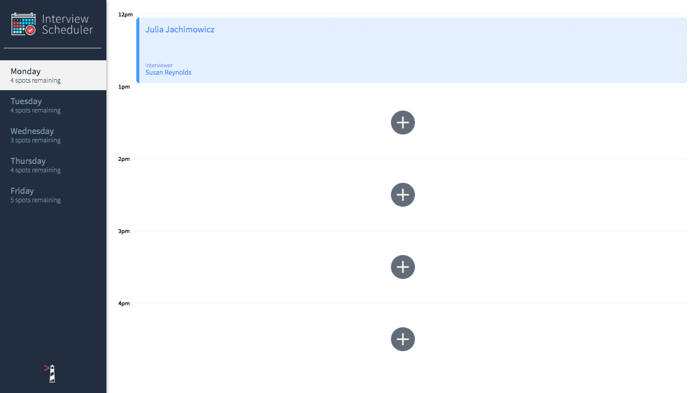

# Interview Scheduler

A scheduler tool that allows users to create, edit, and delete interviews. The interviews can be created by inputting the name of a student and selecting an interviewer from a list. This project uses HTML, CSS, JS, React,Webpack, Babel, Axios, Storybook, Jest, Cypress, Testing Library

## The Final Product
<a href="https://youtu.be/VtDZQggR4uk" target="_blank"></a>

## Setup

Install dependencies with `npm install`.

## Running Webpack Development Server

```sh
npm start
```

## Running Jest Test Framework

```sh
npm test
```

## Running Storybook Visual Testbed

```sh
npm run storybook
```
